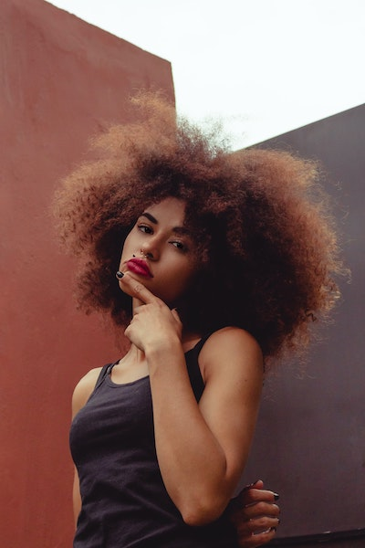
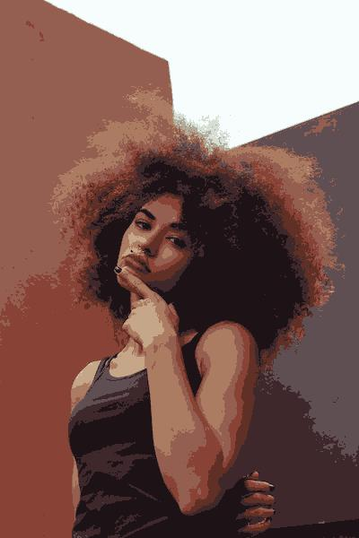
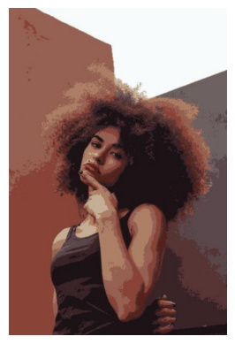

# Paint by numbers
A pythonic approach to generate paint by numbers like graphics using unsupervised learning(?)
Then a blur filter is used to soften the edges.

## Approach
Create random number of points in RGB space and group closest pixels, calculate average value and regroup until there are little changes of pixels between runs.

Currently there will be groups that go unused and groups that are too big - future work could include dynamically splitting these groups to give more accurate colours.

## Demo
### Original Photo
Photo by Bruno Thethe from Pexels (Resized to 400x600)

### Post pixels grouping

### Post blur

